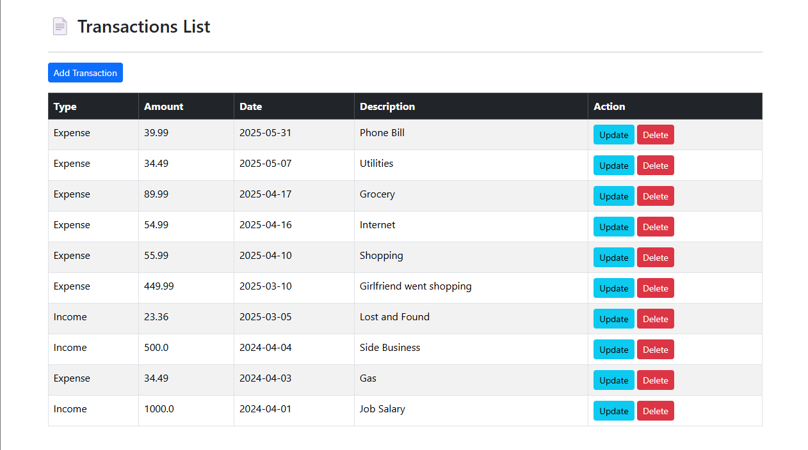
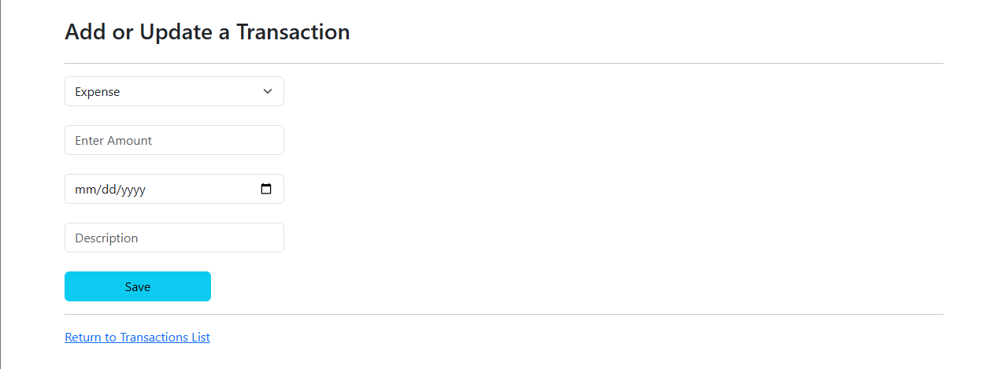
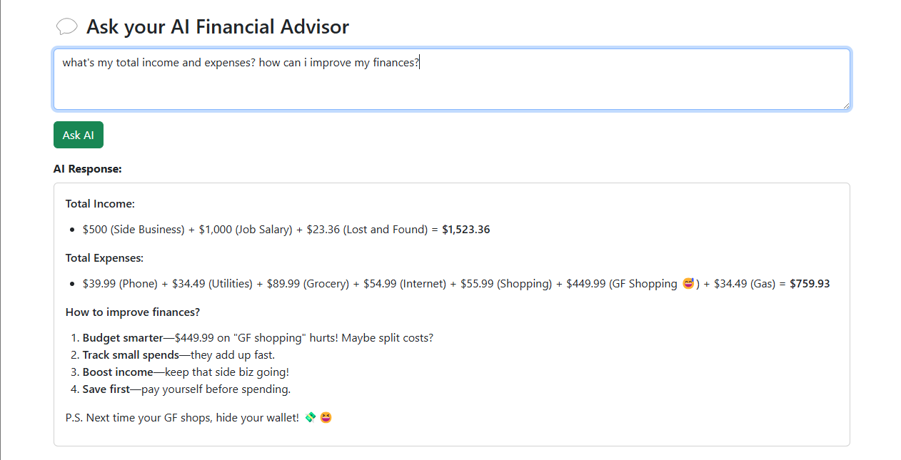

# Finance Trackr - a Personal Finance Webapp

Finance Trackr is a personal finance web app that allows users to manage their income and expenses with full CRUD functionality and receive personalized financial recommendations from an AI advisor based on their transaction history.

## Tech Stack

- Spring Boot (Backend)
- Thymeleaf (Frontend)
- Bootstrap CSS (Styling)
- MySQL (Database)
- OpenRouter API (AI Integration)

## Features

- Create, read, update, and delete income and expense transactions
- Get personalized AI-generated financial insights based on your transaction history
- Clean and responsive UI using Bootstrap

## Getting Started

### Prerequisites

- Java 17+
- Maven
- MySQL
- OpenRouter API key

### Setup Instructions

1. **Clone the repository**
   ```bash
   git clone https://github.com/yourusername/finance-trackr.git
   ```

2. **Configure `application.properties`**

   Update the `src/main/resources/application.properties` file with your database and OpenRouter API credentials:

   ```properties
   #
   # JDBC properties
   # change these to match your database configuration
   #
   spring.datasource.url=jdbc:mysql://localhost:3306/finance_tracker
   spring.datasource.username=springstudent
   spring.datasource.password=springstudent

   #
   # OpenRouter AI Properties
   # change these to match your OpenRouter API configuration
   #
   openrouter.api.key=
   openrouter.api.url=https://openrouter.ai/api/v1/chat/completions
   openrouter.api.model=deepseek/deepseek-chat-v3-0324:free

   openrouter.system.prompt=You are a helpful AI financial advisor. You answer questions based on user's personal transactions.
   ```
   > **Note:** Make sure to generate and use your API key from OpenRouter. You can also configure the AI model to any available option from OpenRouter. 

3. **Set up the MySQL database**

   Run the provided SQL script ``finance_tracker.sql`` in MySql to create the database schema and insert some sample transaction data.

4. **Run the application**

   Run the Finance Trackr application using IntelliJ or from the command line with:
   ```bash
   mvn spring-boot:run
   ```

5. **Access the app**

   Open your browser and go to:
   ```
   http://localhost:8080/transactions/list
   ```

## Screenshots

### Home page



### Add/Update page



### AI Advisor response



## Future Improvements

- Implement user authentication with Spring Security
- Associate transactions with specific users
- Add visual dashboards and analytics for better insights
